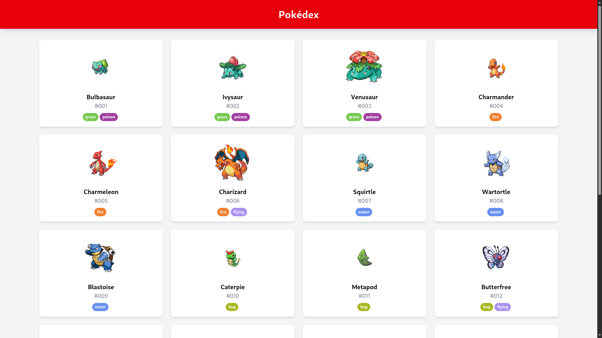

# Pokemon API con React

Una aplicación web para explorar información sobre los Pokemons utilizando la [PokéAPI](https://pokeapi.co/). La aplicación muestra una lista paginada de Pokémon y permite ver detalles específicos de cada uno.

 

## Instalación

Sigue estos pasos para configurar el proyecto localmente:

1. Clona el repositorio:
```bash
git clone https://github.com/JDonquis/pokemon-api.git
cd pokemon-api
```

2. Instala las dependencias:

```bash
npm install
```
3. Corre la apliación con el siguiente comando:

```bash
npm run dev
```

## Tecnologías utilizadas

- React 18
- React Router 6
- Tailwind CSS 4
- Axios
- Vite (como bundler)
